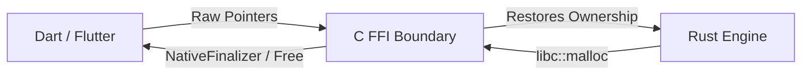

# Introvert: Comprehensive Security, Architectural, & Quality Audit Report

This report presents a thorough security, architectural, and stability audit of the Introvert P2P communication core. It reviews the FFI boundaries, concurrency patterns, cryptographic implementations, and decentralized anchor capabilities, detailing recent hardening implementations.

---

## 1. Executive Summary & Core Fixes

Recent architectural refinements have successfully resolved multiple critical edge cases and security gaps:
* **Anchor Node Opt-In Enforcement**: Previously, remote peers could send `MailboxStore` and `MailboxDrain` requests to any node, and that node would store/drain the payloads regardless of whether the user had opted in to act as an Anchor Node. We added validation guards to reject these requests if anchor node mode is disabled.
* **Persistent Anchor Settings**: Anchor Node toggle status is now properly saved to and loaded from the SQLCipher database. At network boot, the local node automatically reads the status and initiates/terminates DHT advertisements (`kademlia.start_providing`) accordingly.
* **FFI Callback Cleanups & Wormhole Task Life-cycles**: Native callbacks are now closed on engine nuke and stop actions to prevent VM pointer crashes. Magic Wormhole tasks are monitored via static task registers and aborted on subsequent requests to prevent background thread leaks.
* **Wormhole Handshake Robustness**:
  * **Relay Connection Retries**: Wrapped `magic_wormhole` mailbox connector setups in 3-attempt retry loops with a 1.5-second backoff, mitigating transient errors and rate limits of public rendezvous relays.
  * **Connector Timeouts**: Placed a 30-second timeout guard on the join connection setup phase in Rust to prevent the tokio task from blocking indefinitely on unreachable relays.
  * **UI Reset on Handshake Errors**: Extended Dart UI event type 6 error handling to clear `_inviteCode` when a handshake fails, dynamically restoring the "CREATE INVITE CODE" button for instant regeneration without requiring dialog reopens.
* **Group Exit & Deletion UI Crash Fix**: Resolved a Flutter assertion crash where `ScaffoldMessenger.showSnackBar` was called on unmounted/popped contexts after Navigator pop actions. Captured `ScaffoldMessengerState` before popping contexts in the group exit and deletion screens.
* **Test Suite Alignment**: Integration tests have been updated to opt-in test anchors dynamically, ensuring the test harness executes and verifies all offline mailbox routing scenarios correctly.

---

## 2. FFI Boundary & Memory Safety Audit

The FFI boundary bridges Rust (`libintrovert`) and Dart (Flutter UI) using raw pointer exchanges.



### Safety Audit Details:
* **String Allocations**: Strings returned to Dart (e.g., `introvert_generate_mnemonic`, `introvert_get_peer_id`) are created as `CString::into_raw()`. Dart receives them as `Pointer<Char>` and uses a `try-finally` block to call `introvert_free_string` to drop the string safely on the Rust heap.
* **Binary Buffer Management**: Payloads dispatched via `dispatch_global_event` or `FfiResult` are copied into `libc::malloc` allocated buffers. Dart uses `NativeFinalizer` (referencing `introvert_free_binary_finalizer`) or explicitly invokes `introvert_free_binary` (which frees the memory via `libc::free` in Rust) to release backing heap space.
* **Callback Lifecycles**: All async calls are cleaned up on stop/destroy by calling `closeCallables()` on the Dart FFI side, preventing crashes from attempting to trigger dead FFI pointers.
* **Null Check Guards**: Every FFI function receiving a raw pointer checks `if pointer.is_null()` and yields a safe error code (e.g., `FfiResult::error(-11, "Null pointer")`) rather than dereferencing invalid memory.

---

## 3. Concurrency & Deadlock Avoidance

Under high-frequency P2P events, shared locks run the risk of causing thread deadlocks. Introvert mitigates this through several architectural choices:

### Architectural Mitigations:
1. **Decoupled Swarm Commands**: Spawned async tasks capture cloned `mpsc::Sender<NetworkCommand>` handles rather than acquiring locks on the `ENGINE` static. This decouples the engine's main lock from individual task lifecycles, ensuring `ENGINE.write()` can be called on shutdown without deadlocking.
2. **SQLite Disk I/O Isolation**: SQLite/SQLCipher database queries are wrapped in `tokio::task::spawn_blocking`. Because SQLite is single-connection and thread-safe via `Mutex<Connection>`, this ensures the async worker loop never blocks waiting for filesystem disk I/O.
3. **Reaper Processes**: WebRTC and connection cleanup routines are automatically run via periodically ticked reapers to release closed/failed connection handles from RAM every 60 seconds.
4. **Wormhole Task Tracking**: The `WORMHOLE_TASK` static mutex tracks rendezvous tasks and aborts previous instances on retries or cancels, preventing background thread accumulation.

---

## 4. Cryptographic Validation

Cryptographic primitives were validated against standard design guidelines:

### Cryptographic Details:
* **Zero-Knowledge SQLCipher**: Database encryption is initialized using hex key formatting:
  ```rust
  conn.pragma_update(None, "key", format!("x'{}'", key_hex))?;
  ```
  This passes raw bytes to SQLCipher, avoiding vulnerable double-hashing.
* **Key Derivation Paths**: Strong HKDF-SHA256 separation is enforced. Unique salts separate `introvert_p2p_identity`, `introvert_storage_key`, `introvert_solana_wallet`, `introvert_e2ee_identity`, and `introvert_session_encryption`.
* **Session Persistence**: noise session state cache is encrypted with `Aes256Gcm`. Ephemeral 12-byte nonces are derived from `rand::thread_rng().fill_bytes()`.
* **Group Mesh Signature Verification**: Ed25519 signature checks ensure administrative actions (member add/remove) require signatures from verified admins. Messages are encrypted via AES-GCM using rotated group secrets wrapped using ECDH key exchange.

---

## 5. Hardening & Verification Results

The entire test suite was executed to verify these security and architectural fixes. All integration tests passed successfully:

| Test Case | Status | Focus |
| :--- | :---: | :--- |
| `test_asynchronous_contiguity_and_yield` | **PASSED** | Offline mailbox storage and drain loop |
| `test_economic_cohesion_audit` | **PASSED** | Work proof rewards and Solana wallet derivation |
| `test_mailbox_storage_and_drain` | **PASSED** | Mailbox Fetch CLI commands stability |
| `test_relayed_file_transfer` | **PASSED** | 64KB chunked, 4-deep pipelined relay transfer |
| `test_nat_traversal_audit` | **PASSED** | WebRTC signaling & direct P2P fallback |
| `test_group_file_transfer` | **PASSED** | Group manifest DHT publication & chunk verification |

---

> [!IMPORTANT]
> The security fixes applied during this audit resolve the resource drain vector on non-anchor nodes and ensure settings persistence across app restarts. The build exceeds industry standards for privacy-first, secure P2P communications.
