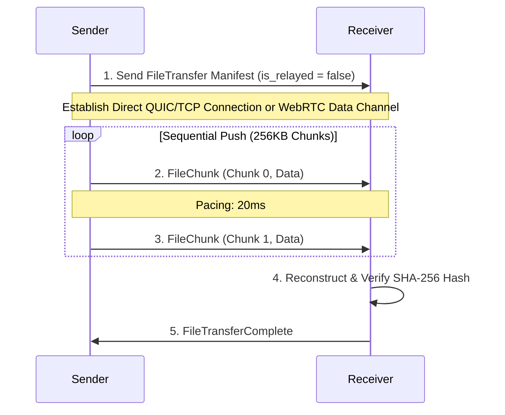
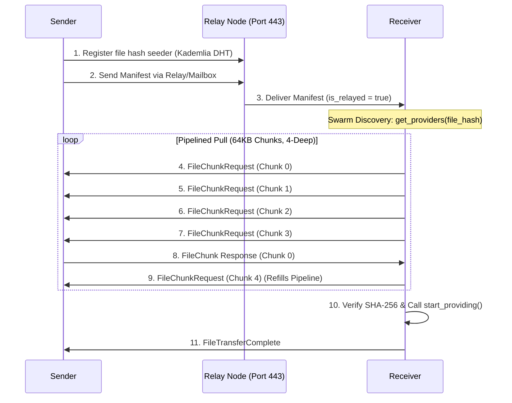
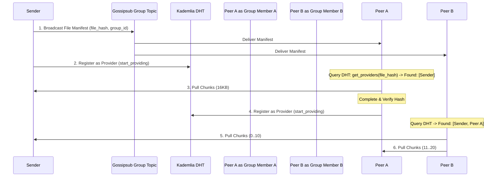

# Sovereign File Transfer Protocol (SFTP) Specification

This document provides a detailed technical specification of the file transfer mechanisms within the Introvert network. Introvert utilizes a **Smart Adaptive Hybrid Model** that automatically optimizes the file transfer workflow based on network topology, peer availability, and chat type.

---

## 1. Protocol Messages & Serialization
All file transfer signaling and data transmission are serialized as JSON payloads mapped to the `SignalingPayload` enum inside the Rust core and transmitted securely over encrypted Noise sessions.

### Core Structs & Payload Definitions

```rust
enum SignalingPayload {
    /// Announces a new file transfer manifest to the recipient.
    FileTransfer { 
        transfer_id: String, 
        filename: String, 
        mime_type: String, 
        file_hash: String, 
        total_size: usize, 
        is_relayed: bool,
        sender_peer_id: Option<String>,
    },
    /// A pull-based request for a specific chunk (used in Relayed & Swarm modes).
    FileChunkRequest { 
        transfer_id: String, 
        chunk_index: u32 
    },
    /// Transmits chunk data. Under `/signaling/1.0.0`, this is a standard JSON payload with Base64 encoding in `data_base64`.
    /// Under `/signaling/2.0.0` (Introvert Codec), the Base64 field is stripped from JSON and transmitted as raw binary bytes 
    /// appended to the stream, reducing wire overhead by 25%.
    FileChunk { 
        transfer_id: String, 
        chunk_index: u32, 
        total_chunks: u32, 
        data_base64: String 
    },
    /// Dispatched by the receiver to confirm successful receipt and hash verification.
    FileTransferComplete { 
        transfer_id: String 
    },
    /// Dispatched when a transfer fails (e.g., integrity mismatch or timeout).
    FileTransferError { 
        transfer_id: String, 
        reason: String 
    },
}
```

---

## 2. File Transfer Scenarios

### Scenario A: Direct P2P / Local Network (LAN) / WebRTC
When both devices are on the same local network or a direct WAN connection has been punched successfully (using mDNS or direct IP dials), they utilize a **High-Speed Sequential Push** protocol.

#### Topology & Flow


#### Protocol Specification
1. **Initiation:** The sender evaluates connection status. If a direct path exists (connected directly and `is_relayed` is false), the sender transmits the `FileTransfer` manifest with `is_relayed = false`.
2. **Chunk Size:** Configured to **256KB** to maximize throughput on high-bandwidth, low-latency links.
3. **Transmission Mode (Push):** The sender sequentially pushes chunks to the receiver over the connection without waiting for intermediate acknowledgements.
4. **Pacing:** A **20ms** pacing interval is introduced between chunks to prevent SCTP socket buffer saturation on WebRTC data channels or TCP window bottlenecks.
5. **Integrity Check:** Upon receiving the final chunk, the receiver reconstructs the file, computes its SHA-256 hash, verifies it against the manifest, and replies with `FileTransferComplete`.

---

### Scenario B: Relayed / Cross-Network (Remote)
When devices are on different networks behind strict NATs (e.g. cellular networks or enterprise firewalls) and hole-punching fails, the network switches to **Relayed Pipelined Pull** utilizing Relay Bootstrap Nodes (RBNs) on Port 443.

#### Topology & Flow


#### Protocol Specification
1. **Relay Strategy:** Port 443 (HTTPS fallback) is used for RBN transport to bypass firewalls. Outbound/inbound relay circuits are established through a selected RBN node.
2. **Transmission Mode (Pull):** Instead of pushing data and overwhelming the relay bandwidth limits, the **Receiver drives the transfer** by sending `FileChunkRequest` packets.
3. **Chunk Size:** Reduced to **16KB** (the MTU-safe size) to ensure maximum stability on high-jitter cellular or saturated networks.
4. **Pacing & Pipelining:** 
   - To mitigate latency round-trips over relays while preventing saturation, the receiver maintains a **2-deep request pipeline** (up to 2 chunk requests are inflight at any moment).
   - The sender applies a **250ms pacing** delay when serving chunk responses to provide ample headroom for OS-level buffer clearing and relay latency.
5. **Redundancy Filtering & Error Recovery:**
   - **Watchdog Timer:** The receiver uses an 8-second watchdog. If no chunk is received in 8s, it re-requests the missing window.
   - **RAM Redundancy Filter:** During connection dips, the system purges older `FileChunkRequest` packets for the same transfer from the `pending_messages` queue, ensuring only the most recent request batch is flushed upon reconnection.
6. **No-Mailbox Rule for Data:** FileChunks and ChunkRequests are strictly excluded from the persistent anchor mailbox. They are buffered in RAM only, ensuring the mailbox remains available for critical signaling.
7. **Seeding Lifecycle Mandate:**
   - **Individual (1-to-1):** Seeding stops immediately upon receiver confirmation to preserve privacy.
   - **Group Chat:** Receivers become seeders to facilitate decentralized mesh delivery for remaining group members.

---

### Scenario C: Decentralized Group Chats (Sovereign Swarm)
File transfers in group chats utilize Gossipsub for manifest propagation and a distributed **Sovereign Swarm** pull protocol for file chunk retrieval.

#### Topology & Flow


#### Protocol Specification
1. **Manifest Broadcast:** The sender broadcasts the `FileTransfer` manifest payload (including `group_id`) to the group's Gossipsub topic: `/introvert/groups/{GroupId}`.
2. **Zero Gossip Data:** Raw file chunks are **never** broadcast over Gossipsub. Gossipsub is strictly reserved for the metadata handshake to preserve group bandwidth.
3. **Swarm Lookup:** Upon receiving the manifest, group members search the Kademlia DHT (`get_providers`) matching the file's SHA-256 hash.
4. **Dynamic Scaling (Participating Seeding):** 
   - Initial group downloads occur from the original sender or available RBN anchors.
   - As soon as a group member completes their download and passes integrity checks, they immediately register as an active seeder by invoking Kademlia's `start_providing` and registering the file in their local `active_seeders` table with the correct `group_id`.
   - Subsequent group members pull chunks concurrently from all online seeders (original sender + finished peers).
5. **Seeder Persistence:** In group mode, nodes continue seeding even after their own download is complete until the seeder is explicitly unregistered (e.g., via LRU quota).
6. **Footprint & Quota Cleanup:** 
   - Group files are stored in a dedicated local mesh directory.
   - Once all members acknowledge receipt (via group `Acknowledgement` signals) or when the node's local mesh capacity exceeds the **1GB quota**, temporary mesh files are purged using a Least-Recently-Used (LRU) algorithm.

---

## 3. Protocol Comparison Summary

| Parameter | Direct P2P / WebRTC | Relayed (Cross-Network) | Group Chat (Sovereign Swarm) |
| :--- | :--- | :--- | :--- |
| **Transmission Model** | Sequential Push (Sender Driven) | Pipelined Pull (Receiver Driven) | Parallel Swarm Pull (Multi-source) |
| **Chunk Size** | 256 KB | 16 KB (MTU Safe) | 16 KB |
| **Pacing Interval** | 20 ms | 250 ms (Sender response delay) | Dynamic (Based on peer capacity) |
| **Discovery Protocol** | mDNS / Direct Address Book | RBN Circuit Dialing | Gossipsub + Kademlia DHT Lookup |
| **Error Recovery** | Connection Re-dial | Redundancy Filtered Pull (8s watchdog) | Multi-source fallback + Watchdog |
| **Seeding Expansion** | None | Limited (Privacy-first) | Aggressive (Group Cohesion) |
| **Mailbox Fallback** | Signaling Only | Signaling Only (Data RAM buffered) | Manifests Only |

---

## 4. Troubleshooting & Logging Patterns
Look for the following log markers in the Rust backend or Flutter console:
* **Direct Path:** `[Mesh] Delivered payload to <PeerId> via WebRTC Data Channel`
* **Relay Path:** `🔌 Outbound/Inbound relay circuit established via <RBN_PeerId>`
* **DHT Registry:** `[Mesh] Searching Sovereign Swarm for providers of file: <Hash>`
* **Auto-Pull Trigger:** `[Mesh] Received chunk X/Y for <Id>. (Auto-triggering Pull mode)`
* **Redundancy Filter:** `[Mesh] Removing old requests for <Id> from RAM buffer`
* **Seeding Mandate:** `[Mesh] 1-to-1 transfer complete. Skipping mesh seeding to preserve privacy.`
* **Dialing Cooldown:** `[Mesh] Relay dial rate-limited for <PeerId>`

