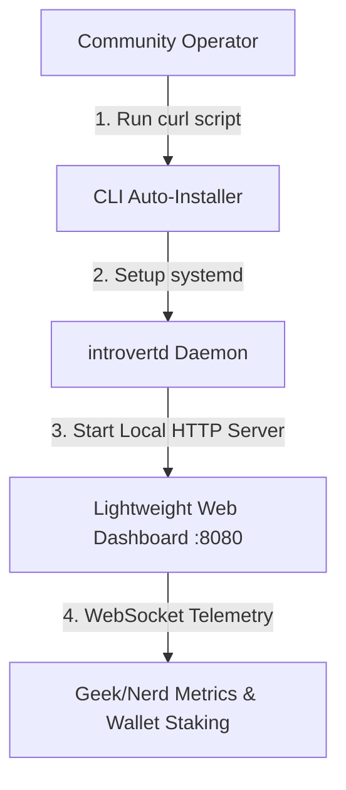
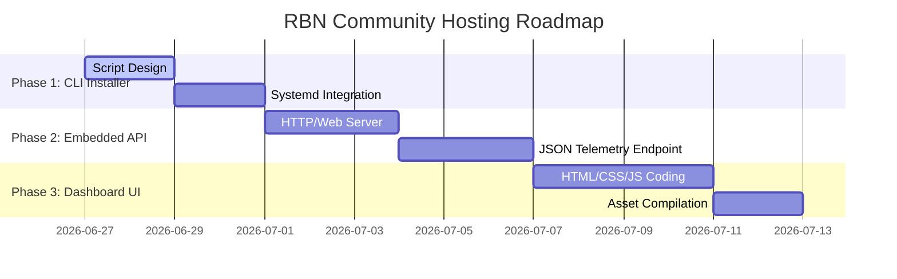

# RBN Community Hosting: CLI Installer & Geek Web Dashboard Specification
**Status:** ✅ Completed (June 27, 2026)
**Target:** Headless Linux VPS / Home Nodes

This document establishes the blueprint for enabling the Introvert community to easily host Root Bootstrap Nodes (RBNs). It outlines the **CLI Auto-Installer Script** and the **Dashboard Web GUI** designed with premium telemetry for node operators.

---

## 🗺️ System Architecture



---

## 🛠️ Section 1: The CLI Auto-Installer (`setup_rbn.sh`)

The entry point for operators must be a single-command install script that sets up the environment, configures security boundaries, and registers the node.

### Execution Flow:
```bash
curl -sSf https://get.introvert.network/setup-rbn.sh | sh
```

### Installation Steps:
1.  **Platform Detection:** Detects CPU architecture (x86_64, ARM64) and distribution (Ubuntu, Debian).
2.  **Toolchain Setup:** Automatically verifies and installs Rust, GCC, pkg-config, and OpenSSL development headers.
3.  **Secure Identity Generation:** 
    *   Generates a fresh 12-word seed phrase (using `introvert` core libraries) or accepts an existing key.
    *   Derives the permanent Libp2p Peer ID and the derived Solana wallet address.
4.  **IP & Address Verification:** Query public routing tables to verify Port 443 is open and determine the public IP.
5.  **Service Installation:** Installs a hardened `/etc/systemd/system/introvertd.service` configuration:
    *   `Restart=always`, `RestartSec=5`
    *   Strict file permissions (`chmod 600` for credentials).
6.  **Wallet Funding Intercept:** Displays a **text-based QR code** of the Solana wallet address directly in the terminal, instructing the user to fund it with Devnet/Mainnet SOL before finishing registration.

---

## 📊 Section 2: The Operator Web Dashboard (Web GUI)

Once running, `introvertd` runs a lightweight, password-protected HTTP server (built on `axum` or `tiny-http`) on local port `8080` to render the dashboard.

### 🎨 Visual Theme & Aesthetics
*   **Color Palette:** Ultra-sleek dark mode utilizing curated deep slate grays (`#0B0F17`), neon cybercyan (`#00F2FE`), and electric purple (`#7F00FF`) accents.
*   **Logo & Icon:** Features the official vector **Introvert Icon** (embedded as raw inline SVG inside the HTML for zero external asset dependencies).
*   **Layout:** Glassmorphic dashboard tiles with subtle glowing shadows, smooth transitions, and responsive grid layouts.

### 🔬 Telemetry & "Geek Stats" Dashboard Layout

```
+---------------------------------------------------------------------------------------------------+
|  [Logo] INTROVERT RBN DAEMON | Node: Online (Port 443)                           Uptime: 24d 12h  |
+---------------------------------------------------------------------------------------------------+
|  [ WALLET & STAKING STATUS ]          |  [ MESH ROUTING TELEMETRY (libp2p DHT) ]                   |
|  Address: 4zMMC...a9G (Devnet)        |  Active Dials: 48           Routing Table Size: 842        |
|  SOL Balance: 1.24 SOL                |  Direct Peers: 12           Relayed Peers: 741             |
|  INTR Stake: 2,000,000 INTR [STAKED]     |  Query Latency: 124ms       Packet Drops: 0.002%           |
|  Claimable Accruals: 4,120 INTR       |                                                            |
+---------------------------------------------------------------------------------------------------+
|  [ LIVE BANDWIDTH THROUGHPUT ]        |  [ HARDWARE & DATABASE TELEMETRY ]                         |
|                                       |  CPU Load: [|||||.......] 32% (4 Cores)                    |
|  IN:  | \__/\   2.4 MB/s              |  RAM Usage: [||||||||...] 820MB / 2.0GB                    |
|  OUT: |  \__/\  8.1 MB/s              |  Disk Space: 14.2 GB / 40.0 GB                             |
|  Relayed Total: 1.4 TB (This month)   |  SQLite cryptostorage page count: 4,120                    |
+---------------------------------------------------------------------------------------------------+
|  [ REAL-TIME DIAGNOSTIC CONSOLE LOGS ]                                                             |
|  10:04:12 [Network] Swarm dialed relay circuit via Peer 12D3KooW...                               |
|  10:04:25 [SolanaRegistry] Sync verified: On-chain multiaddress matches public IP.                 |
+---------------------------------------------------------------------------------------------------+
```

### Geek-Targeted Data Panels:
1.  **Peer Swarm Matrix:**
    *   **DHT Bucket Graph:** Interactive list showing Kademlia bucket distributions (0..20) and peer density.
    *   **Round Trip Time (RTT):** Latency spectrum breakdown of active connections.
2.  **Bandwidth Pacing:**
    *   Live SVG-rendered graph mapping actual bandwidth usage.
    *   Cumulative bandwidth counters (Routed, Dropped, Dropped via Resource Limits).
3.  **On-Chain Staking & Stated Rent:**
    *   Registry PDA lease status (Current slot vs lease expiration slot).
    *   Current Solana block height and blockhash confirmation latency (ms).
4.  **Hardware & SQLite Performance Metrics:**
    *   Disk I/O read/write write-back delay.
    *   SQLite cache hit ratio, database page counts, and WAL file size.
5.  **Diagnostic Control Panel (Command Drawer):**
    *   `[Trigger DHT Bootstrap]` - Clears and re-bootstraps the Kademlia routing engine.
    *   `[Force On-Chain Sync]` - Updates multiaddress details on the Solana contract manually.
    *   `[Drain Logs]` - Exports raw system logs for debug triage.

---

## 📈 Implementation Phases



*   **Phase 1 (CLI Installer):** Completed. Wrote the interactive auto-installer at [scripts/setup_rbn.sh](file:///Users/dev/Development/introvert/scripts/setup_rbn.sh).
*   **Phase 2 (Embedded API):** Completed. Built a zero-dependency local TCP listener inside the daemon that parses HTTP requests and serves JSON stats securely from FFI counters, Solana Devnet, and the OS telemetry.
*   **Phase 3 (Dashboard Web GUI):** Completed. Crafted a glassmorphic dashboard interface inside [src/dashboard.html](file:///Users/dev/Development/introvert/src/dashboard.html) and embedded it into the compiled daemon binary.

