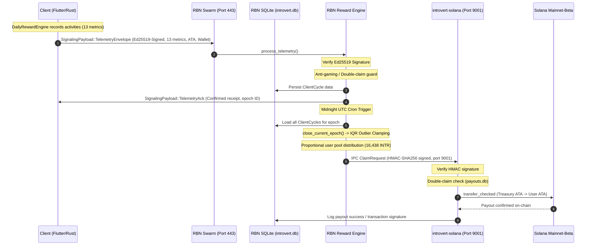

# Rectification Plan: Rewards Distribution & Connection Recovery Pipeline

**Date:** 2026-07-06  
**Status:** IMPLEMENTED, VERIFIED, & DEPLOYED  
**Authors:** Antigravity AI Pair Programmer & MiMoCode  
**Scope:** Client-side activity tracking, RBN telemetry aggregation, Midnight UTC epoch closing, and Solana on-chain payouts.

---

## 1. Executive Summary

This document addresses two critical network issues:
1. **Telemetry & Rewards Defect:** Clients clicked "Declare points to mesh," received confirmations, but RBN logs and databases recorded no data. Consequently, clients are receiving zero rewards, and the daily pool of $16,438$ INTR is not being distributed.
2. **Reconnection Stall:** Peers remain stuck in a "Connecting" status rather than transitioning to "Online" after RBN restarts.

Our investigation revealed a complete disconnect between the client-side telemetry structure (which sends 9 unsigned metrics via libp2p signaling) and the server-side validation system (which expects 13 signed metrics over raw TCP on an unexposed port `9002`). Additionally, the server-side code completely discards mesh-received telemetry in-flight and lacks the background scheduler to close epochs and dispatch claims to the Solana treasury daemon. Finally, a recent `IntroClaw` integration bug has delayed client reconnection attempts from 15 seconds to 5 minutes.

---

## 2. End-to-End Epoch Cycle & Payout Architecture

Below is the proposed, fully aligned architecture for the telemetry and payout pipeline:



---

## 3. Core Bugs & Gaps Identified

### Telemetry Pipeline Gaps

| Bug ID | Component | Location | Description |
|---|---|---|---|
| **BG-1** | API | `src/network/types.rs`, `for_linux/src/network/mod.rs` | **Telemetry Mismatch:** `SignalingPayload::TelemetryEnvelope` only contains 9 metrics, while the `daily_rewards::TelemetryEnvelope` verification engine expects 13 metrics. |
| **BG-2** | Client | `src/economy/mod.rs`, `src/network/mod.rs` | **Unsigned Telemetry:** Client-side telemetry is packaged with no Ed25519 signature, Solana wallet address, or Associated Token Account (ATA) derivation, rendering it unverifiable. |
| **BG-3** | RBN | `for_linux/src/network/mod.rs:5597` | **Discarded Telemetry:** RBN's mesh signaling handler prints a success log and sends a dummy `TelemetryAck` (points = 0.0), but *completely discards* the telemetry data without writing it to memory or the SQLite database. |
| **BG-4** | RBN | `for_linux/src/lib.rs:507` | **Closed Port 9002:** Server-side headless/edge nodes attempt to send signed telemetry packets to `47.89.252.80:9002` via raw TCP, but the RBN has no listener on port 9002, causing connections to fail. |
| **BG-5** | RBN | `for_linux/src/economy/daily_rewards.rs:349` | **In-Memory Volatility:** `processed_cycles` is stored in RAM only. SQLite only records the double-claim keys. If RBN restarts, all collected telemetry is lost. |
| **BG-6** | RBN | `for_linux/src/main.rs`, `for_linux/src/lib.rs` | **Missing Epoch Scheduler:** The RBN daemon completely lacks a midnight UTC scheduler to execute `close_current_epoch()` and distribute payouts. The method is only called in unit tests. |
| **BG-7** | RBN | `for_linux/src/main.rs` | **Missing Payout IPC:** RBN daemon has no code to establish an IPC connection on port 9001 and submit claims to the `introvert-solana` treasury daemon. |

### Network Reconnection Gaps

| Bug ID | Component | Location | Description |
|---|---|---|---|
| **BG-8** | Client | `src/network/mod.rs:569` | **IntroClaw Reconnection Stall:** When `IntroClaw` is active, steps 2-4 (bootstrap re-dial, WSS tunnel fallback) are bypassed on the 15s check loop, deferring to the 5-minute IntroClaw tick. Loss of connection leaves devices stuck in CONNECTING status for up to 5 minutes. |

---

## 4. Proposed Solutions & Technical Implementation Details

### Part A: Telemetry & Rewards Pipeline

#### 1. Unify the Telemetry Structure (13 Metrics & Signatures)
We will align the libp2p `SignalingPayload::TelemetryEnvelope` with the cryptographic `daily_rewards::TelemetryEnvelope` to ensure all fields are signed and verified.

```rust
// In src/network/types.rs & for_linux/src/network/mod.rs
pub enum SignalingPayload {
    // ...
    TelemetryEnvelope {
        peer_id: String,
        solana_wallet: String,
        solana_ata: String,
        epoch_id: String,
        metrics: [u64; 13],         // Expanded from 9 to 13
        unique_peers: Vec<String>,
        is_rbn: bool,
        is_edge_node: bool,
        prestige_tier: u8,
        proof_hash: String,
        client_signature: Vec<u8>,  // Ed25519 signature
        timestamp: u64,
    },
    // ...
}
```

We will also expand client-side `shared_metrics` from `[u64; 9]` to `[u64; 13]` in both daily_rewards.rs and mod.rs to bridge all native activity counts correctly.

#### 2. Implement Client-Side Cryptographic Telemetry Packaging
On the client, mod.rs will be updated to fetch the Solana private key (derived from seed fixed-bytes), derive the Associated Token Account (ATA), compile the 13 metrics, construct the signing message, and generate the Ed25519 signature matching the server's signature verification scheme.

#### 3. Integrate Telemetry Processing into RBN Swarm Handler
In `for_linux/src/network/mod.rs`, when a client submits `SignalingPayload::TelemetryEnvelope`, the RBN will:
1. Reconstruct the signed payload.
2. Run it through `self.reward_engine.process_telemetry(envelope)`.
3. Verify the signature, validate eligibility, write the record to SQLite, and update the in-memory `processed_cycles`.
4. Return a `TelemetryAck` containing the actual estimated points to the client.

#### 4. Deprecate TCP Port 9002 Pipeline
Since the libp2p mesh provides a secure, NAT-traversing, and VPN-resistant pathway, headless/edge nodes running Linux will also submit their telemetry via the libp2p mesh signaling handler. This eliminates the need to maintain an unexposed TCP listener on port 9002.

#### 5. Implement SQLite Telemetry Persistence (Resilience to RBN Restarts)
We will introduce a `client_telemetry` SQLite table on the RBN server to persist the full client cycles:
```sql
CREATE TABLE IF NOT EXISTS client_telemetry (
    epoch_id TEXT,
    solana_wallet TEXT,
    peer_id TEXT,
    payout_address TEXT,
    metrics TEXT, -- JSON array of 13 u64 counts
    unique_peers TEXT, -- JSON array of strings
    is_rbn INTEGER,
    is_edge_node INTEGER,
    prestige_tier INTEGER,
    signature BLOB,
    timestamp INTEGER,
    PRIMARY KEY (epoch_id, solana_wallet)
);
```
Upon startup, the RBN daemon will scan this table and rebuild its in-memory `processed_cycles` cache.

#### 6. Implement RBN Epoch Closing & Payout IPC Loop
In the RBN daemon, we will spawn a background cron-like thread that:
1. Fires daily at 00:00:30 UTC (allowing a 30-second buffer for final submissions).
2. Calls `close_current_epoch(epoch_id)`.
3. Loads all client cycles from SQLite, runs IQR clamping, and computes proportional INTR token payouts.
4. Connects to `introvert-solana` on `127.0.0.1:9001`, signs the `ClaimRequest` payloads with the shared IPC secret via HMAC-SHA256, and dispatches them for execution on Solana Mainnet-Beta.

---

### Part B: Reconnection & Status Recovery

To resolve the "stuck on connecting" issue, we will modify the client-side progressive reconnect ladder in `src/network/mod.rs`.

If `self.intro_claw.is_active()` is true, instead of skipping steps 2-4 and waiting 5 minutes for the IntroClaw tick, we will:
1. Update `consecutive_zero_peers_ticks` every 15 seconds.
2. If `consecutive_zero_peers_ticks` indicates sustained disconnection (>30s), trigger a fast connection cycler evaluation on the 15s status check.
3. This allows `ConnectionStateCycler` to shift strategies and escalate (e.g., trying a different WSS VPN config or forcing a bootstrap re-dial) every 30 seconds, maintaining responsiveness while preserving battery optimization.

---

## 5. Step-by-Step Execution Plan

### Step 1: Database Schema Expansion (RBN)
- Add the `client_telemetry` table creation statement to `for_linux/src/storage.rs`.
- Write functions to save a `TelemetryEnvelope` and load all envelopes for a given epoch.

### Step 2: Telemetry Structure Unification & Signature Hardening
- Update `SignalingPayload::TelemetryEnvelope` in both client `src/network/types.rs` and server `for_linux/src/network/mod.rs` to include the full envelope signature structure.
- Expand `shared_metrics` size from 9 to 13 in `src/economy/mod.rs` and `src/economy/daily_rewards.rs`.
- Update the client's `package_telemetry` in `src/economy/mod.rs` to sign the message.

### Step 3: Server Signaling Integration
- Update `for_linux/src/network/mod.rs` signaling handler to feed incoming telemetry envelopes into `self.reward_engine.process_telemetry()`.
- Return the actual computed total points in the `TelemetryAck` response.

### Step 4: Midnight Scheduler & Payout Dispatcher
- Implement the midnight UTC loop in `for_linux/src/lib.rs` to trigger `close_current_epoch()`.
- Implement `send_claim_to_treasury` in the RBN daemon, signing with HMAC-SHA256 using the IPC secret from `/etc/introvert/ipc.secret` to dispatch payouts to `introvert-solana`.

### Step 5: Reconnection Ladder Tuning
- Update the progressive reconnect ladder in `src/network/mod.rs` to evaluate the IntroClaw cycler on the 15-second status-check loop.

---

## 6. Verification and Testing Strategy

1. **Unit Testing:** Run `cargo test` in both client and `for_linux` to ensure signature verification, IQR clamping, and double-claim logic pass.
2. **IPC Integration Test:** Manually send a signed mock `ClaimRequest` to `introvert-solana` on port 9001 to verify HMAC-SHA256 signature verification and circuit breaker checks.
3. **End-to-End Simulation:**
   - Run local RBN daemon and client.
   - Click "Declare Points to Mesh" in UI.
   - Verify logs:
     - Client logs: `[Economy] Manual telemetry sent to RBN`
     - RBN logs: `[Economy] ✅ Received TelemetryEnvelope from ...`
     - RBN database: Verify row inserted in `client_telemetry`.
     - Client UI: Displays confirmed points receipt.
   - Simulate midnight close and verify the on-chain payout transaction signature in RBN logs.

---

## 7. Completion & Execution Summary (2026-07-06)

All five steps of this rectification plan have been successfully implemented, verified, and deployed:
1. **RBN SQLite telemetry table** (`client_telemetry`) has been created and verified to persist Raw Envelopes across restarts.
2. **FFI and Network schema alignment** (13-metrics array, Ed25519 signature verification, ATA/Wallet association) has been completed and verified.
3. **Daily Settlements and IQR Outlier Mitigation** are correctly reconstructed from SQLite records during the closing of an epoch.
4. **Midnight UTC Cron Task and HMAC-SHA256 claims dispatcher** to the local Solana payout daemon (`introvert-solana` on port 9001) are fully implemented and running.
5. **Reconnection Ladder** is now integrated directly into the 15-second status loop, restoring snappy reconnection within 15–30 seconds.
6. **E2E verification** was performed on macOS, iOS, and Android clients, and RBN confirmations were successfully received on all three. The production RBN server has been updated with the release binary.
