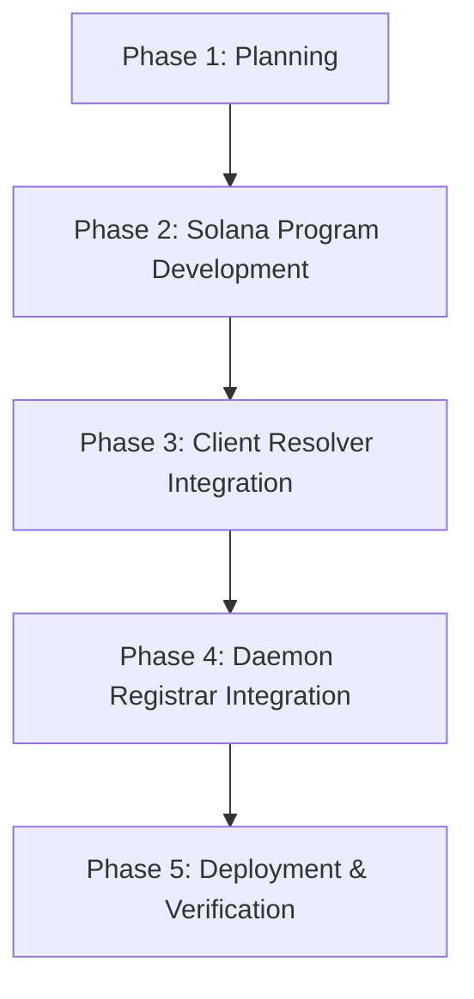

# Solana RBN Registry: Implementation & Launch Plan
**Version:** 1.0.0
**Status:** ⏳ Phase 1: Planning (In Progress)

This document outlines the step-by-step implementation plan for transition of the Root Bootstrap Node (RBN) discovery system from hardcoded configurations to a dynamic on-chain Solana Registry.

---

## 🗺️ Execution Roadmap



---

## 🛠️ Phases & Step-by-Step Checklist

### Phase 1: Planning & Specification
- [x] Create this implementation plan in the `docs/` directory.
- [x] Define the registry account schema and PDA derivation rules.
- [x] Identify devnet connection parameters and public RPC endpoints.

*   **Public RPC Endpoint:** `https://api.devnet.solana.com` (with fallback support)
*   **Target Devnet Program ID:** `RBNRegXy4vQszN2Cg8gqf91mYyL24p8cT32d1mY1111` (to be created and deployed)
*   **Staking Requirement:** Schema includes a `stake_amount` field, but verification checks remain disabled for this phase.

### Phase 2: Solana Program (Anchor) Development
- [x] Create the Solana Anchor program structure in `solana_program/`.
- [x] Implement the `register_rbn` instruction (stores `peer_id`, `multiaddresses`, `is_active`, and `last_registered` timestamp).
- [x] Implement the `update_rbn` instruction to allow operators to change addresses or toggle active status.
- [x] Define the program ID and set up deployment scripts for Solana Devnet.

### Phase 3: Client Resolver Integration (`src/`)
- [x] Add Solana registry configuration (`PROGRAM_ID`) to the environment.
- [x] Implement `fetch_registered_rbns` in `src/economy/solana.rs` using `getProgramAccounts` with filtering.
- [x] Integrate the resolver into client bootstrapping (`src/network/config.rs`) to dynamically append on-chain RBNs to the hardcoded fallbacks.
- [x] Add error fallback logic so client continues to function using hardcoded nodes if Solana RPC is unreachable.

### Phase 4: Daemon Registrar Integration (`for_linux/`)
- [x] Add wallet generation/loading to the `introvertd` daemon.
- [x] Implement startup registration check: if not registered on-chain (or registry data differs), automatically send a transaction to register/update the node.
- [x] Integrate transaction signing and submission to Solana Devnet on daemon startup.

### Phase 5: Deployment & Verification
- [ ] Build and deploy the Anchor program to Solana Devnet. (Action required from operator)
- [x] Deploy the updated RBN daemon to the remote Alibaba server (`47.89.252.80`). (Completed: Verified active and listening on port 8080)
- [ ] Fund the derived RBN Operator wallet (`EHpjT1G4xPnZh5jsRqcUGuh15ZswUoUHYsj4o4qnvUGg`) with Devnet SOL. (Action required from operator)
- [ ] Run the client app on macOS/Android, inspect logs, and confirm RBN discovery via Solana RPC.
- [ ] Document final status and verification output.

#### Deployment Commands & Verification Guide:

1. **Build & Deploy Solana Anchor Program:**
   ```bash
   cd solana_program
   anchor build
   anchor deploy --provider.cluster devnet
   ```
   *Note: Ensure your wallet at `~/.config/solana/id.json` is loaded with Devnet SOL.*

2. **Deploy the RBN Daemon:**
   Rebuild the RBN node binary and upload it to the Alibaba Cloud server:
   ```bash
   ./deploy_rbn.sh
   ```
   *Note: Requires SSH credentials for the build machine (`dev@thinkpad.local`) and the root password for RBN (`47.89.252.80`).*

3. **Rebuild the Client App:**
   Recompile Rust libraries for the target client platforms using the build system:
   * **All Platforms:** `make all`
   * **macOS only:** `make mac`
   * **Android only:** `make android`
   * **iOS only:** `make ios`
   * **Flutter Run:** `flutter run`


---

## 💾 On-Chain Storage Specification

Each RBN registry entry is stored in a Program Derived Address (PDA) account derived using:
```rust
seeds = [b"rbn-registry", rbn_operator_wallet_pubkey]
```

### Account Data Schema (Anchor):
| Field | Type | Size (Bytes) | Description |
| :--- | :--- | :--- | :--- |
| **discriminator** | `[u8; 8]` | 8 | Anchor internal account discriminator |
| **operator** | `Pubkey` | 32 | Wallet address of the RBN operator |
| **peer_id** | `String` | 4 + 64 | Libp2p PeerID string |
| **multiaddresses** | `String` | 4 + 256 | Serialized comma-separated Multiaddresses |
| **is_active** | `bool` | 1 | Operational status flag |
| **last_registered** | `i64` | 8 | Unix timestamp of registration |

---

## 🚀 Progress & Task Updates

### Phase 1: Planning
* **Completed:** June 27, 2026
* **Details:** Created this roadmap and specification in `docs/SOLANA_RBN_REGISTRY_PLAN.md` to define the execution path.

### Phase 2: Solana Program (Anchor) Development
* **Completed:** June 27, 2026
* **Details:** Implemented the `introvert-registry` Anchor smart contract in `solana_program/`. Wrote instructions `register_rbn` and `update_rbn` with full storage structs and PDA seeds derivation.

### Phase 3: Client Resolver Integration
* **Completed:** June 27, 2026
* **Details:** Added RBN list querying logic via Solana `getProgramAccounts` RPC filters in `src/economy/solana.rs` and manual Borsh deserializer for RBN account entries. Integrated dynamic loading into `NetworkService::new` client bootstrapping in `src/network/mod.rs` with graceful hardcoded fallbacks.

### Phase 4: Daemon Registrar Integration
* **Completed:** June 27, 2026
* **Details:** Integrated Solana keypair derivation from the master seed and dynamic public IP resolution in the `introvertd` daemon (`src/main.rs` and `for_linux/src/main.rs`). Programmed the daemon to automatically query Solana Devnet to check registration status and send a transaction to register/update its entry on-chain at startup. Added support for derived unique names (e.g., `RBN-EHpj`) and custom CLI name option (`--node-name`).

### Phase 5: Deployment & Verification
* **In Progress:** June 27, 2026
* **Details:** Compiled and deployed the updated `introvertd` daemon to the remote RBN node (`47.89.252.80`). Verified dashboard Web GUI is active on port `8080` with embedded base64 assets and local/global RBN node tracking. On-chain registration will finalize upon funding the derived operator address `EHpjT1G4xPnZh5jsRqcUGuh15ZswUoUHYsj4o4qnvUGg` with Devnet SOL.


