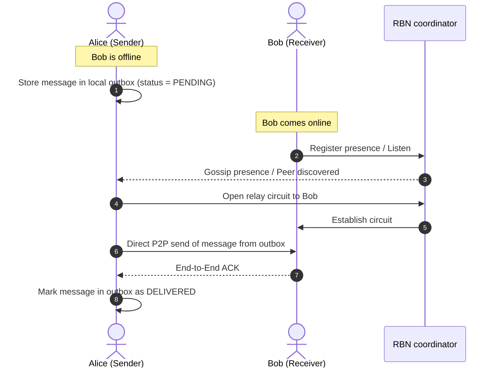
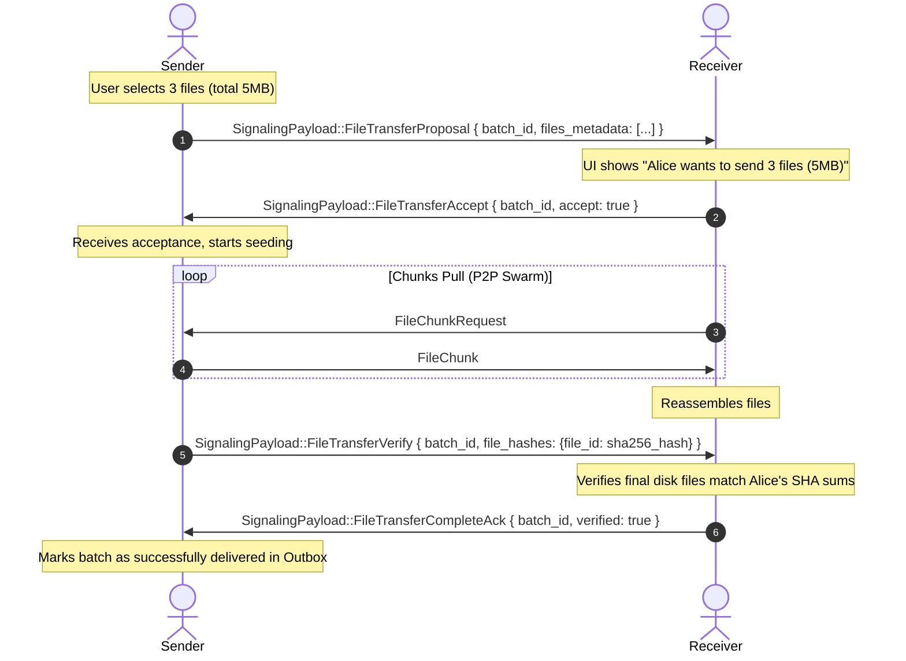

# Sovereign P2P Outbox and Swarm Seeding Architecture Plan

This plan outlines the architectural shift to remove persistent mailbox storage from the RBN nodes and replace it with a fully decentralized, sender-side outbox model combined with peer-to-peer presence-driven delivery and group seeding.

---

## 1. Architectural Philosophy
In a mutable mesh where RBNs can join, drop off, or restart dynamically, server-side mailboxes introduce single-points-of-failure and silent data drops. 

By shifting persistence entirely to the edge:
1.  **Zero Trust RBNs:** RBNs act solely as discovery, coordination, and relay transport nodes. They do not store messages or files.
2.  **Sender Sovereign Persistence:** The sender maintains their own "Outbox". A message is only deleted or marked as delivered when the recipient's client sends an cryptographic end-to-end acknowledgement (ACK).
3.  **Presence-Driven Delivery:** Edge clients track target peer presence. Delivery is triggered the instant a direct connection or relay circuit is active.
4.  **Cooperative Swarm Seeding:** In group chats, any group member who completes a file download immediately starts seeding it to the rest of the group, spreading the bandwidth and eliminating relay bottlenecks.



---

## 2. Proposed Changes

### A. Database Schema Changes (`src/storage.rs`)
We will introduce a new `outbox` table in SQLite to persist unsent messages.

```sql
CREATE TABLE IF NOT EXISTS outbox (
    msg_id TEXT PRIMARY KEY,
    recipient_id TEXT NOT NULL,
    payload BLOB NOT NULL,          -- Encrypted SignalingPayload
    status INTEGER NOT NULL,        -- 0 = Pending, 1 = InFlight, 2 = Delivered
    created_at INTEGER NOT NULL,
    attempts INTEGER DEFAULT 0,
    last_attempt INTEGER DEFAULT 0,
    group_id TEXT                   -- Optional, for group message tracking
);
CREATE INDEX IF NOT EXISTS idx_outbox_recipient ON outbox(recipient_id, status);
```

*   **Helper Methods:**
    *   `save_to_outbox(msg_id, recipient_id, payload, group_id)`
    *   `fetch_pending_outbox_for_peer(recipient_id)`
    *   `update_outbox_status(msg_id, status)`
    *   `increment_outbox_attempts(msg_id)`
    *   `delete_from_outbox(msg_id)`

---

### B. Eliminating RBN Mailbox Code (`src/network/mod.rs`)
*   **Deprecate/Remove Mailbox Storage Payload:**
    *   Remove `SignalingPayload::MailboxStore` and `SignalingPayload::MailboxDrain`.
    *   Remove RBN-side database storage calls (`store_mailbox_payload`, `drain_mailbox`).
*   **Decouple Wakeup from Mailboxes:**
    *   Clients still register push tokens with RBNs on `Identify`.
    *   If a client tries to deliver a message to an offline peer, they send a lightweight push notification request `SignalingPayload::IdentifySleepState` to wake them up.
    *   The message itself remains in the sender's local `outbox` table.

---

### C. Presence & Outbox Sender Loop
*   **Outbox Trigger Events:**
    The outbox delivery queue is flushed for a target `peer_id` immediately upon:
    1.  `OutboundCircuitEstablished` (Mac/Android opened a circuit to the recipient).
    2.  `InboundCircuitEstablished` (Recipient opened a circuit to us).
    3.  Direct P2P connection established (via Kademlia dials or local mDNS).
*   **Reliable Delivery Engine:**
    When flushing the outbox:
    1.  Load all `PENDING` outbox entries for the peer.
    2.  Update status to `InFlight` to prevent race conditions from tick intervals.
    3.  Send the payloads via `forward_to_mesh`.
    4.  If an `Acknowledgement` payload is received matching `msg_id`, delete or mark the entry as `Delivered` in the DB.
    5.  If a request fails or times out (no ACK in 30s), reset status to `Pending` for retry.

---

### D. Group Chat Sovereign Swarm Seeding Flow
For group file sharing:
1.  **Manifest Gossip:** Alice broadcasts the file manifest `FileTransfer` to the group.
2.  **DHT Seeding Registration:** Any peer in the group (e.g. Bob) who successfully downloads and verifies the file immediately registers as a provider for that file's hash in the Kademlia DHT (`start_providing`).
3.  **Active Seeder Discovery:** Other group members (e.g. Charlie) run `FindProviders` on the DHT to discover all completed seeders (Alice, Bob, etc.).
4.  **Optimal Peer Selection:** When Charlie pulls chunks, his client queries connected providers and requests chunks round-robin or based on latency from all online seeders, bypassing the RBN bandwidth bottleneck entirely.

```
                  [Group Chat c19de...]
                          |
             +------------+------------+
             |                         |
       Alice (Original Seeder)    Bob (Completed Seeder)
             \                         /
              \                       /
               v                     v
              Charlie (Downloading Peer)
```

---

## 3. P2P File Transfer Handshaking Protocol
To ensure 100% fail-proof file transfers that respect recipient storage limits and confirm peer readiness, we will implement a two-way handshake sequence.

### A. Manifest Hierarchy: Hybrid Approach
For optimal usage, we will use a **hybrid manifest** model:
1.  **Batch Manifest (High-Level):** Sent first when the user triggers sending multiple files. It groups all files under a single `batch_id` and total size, allowing the receiver to accept/decline the entire batch or display a single combined progress bar.
2.  **Per-File Manifest (Low-Level):** Created for each individual file inside the batch, defining `chunk_size`, `total_chunks`, and the file's SHA-256 hash. This allows the pull loop to request chunks concurrently or resume interrupted files independently.

### B. Two-Way Handshake Flow


---

## 4. Implementation Steps

### Phase 1: Database Setup
*   Add `outbox` migration to `src/storage.rs`.
*   Implement `save_to_outbox`, `delete_from_outbox`, and status update queries.

### Phase 2: Deprecate Mailbox Logic
*   Remove `MailboxStore` processing in the network behaviour.
*   Update RBN behavior to reject/ignore mailbox store requests, forcing clients to keep messages in their local outboxes.

### Phase 3: Outbox Engine & Presence Delivery
*   Add a periodic outbox scheduler (e.g. `outbox_flush_interval` ticking every 10 seconds).
*   Hook into the libp2p swarm events (`ConnectionEstablished`, `InboundCircuitEstablished`, `OutboundCircuitEstablished`) to trigger instant outbox flushes for the connected peer.
*   Add an ACK-matching module to delete successfully delivered payloads from the outbox.

### Phase 4: Swarm Seeding & Handshake Protocol
*   Add `FileTransferProposal`, `FileTransferAccept`, `FileTransferVerify`, and `FileTransferCompleteAck` variants to `SignalingPayload`.
*   Implement the handshake flow in `handle_single_payload` to prompt/accept transfers.
*   Verify that `start_providing` correctly registers group members as seeders on Kademlia.
*   Optimize `select_best_providers_static` to balance requests across multiple concurrent seeders.
